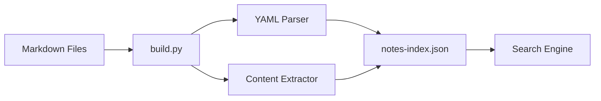

# Search Index Management

Learn how to effectively manage your wiki's search index for optimal performance and comprehensive search capabilities.

## 🔍 Understanding the Search Index

The search index is the heart of your wiki's search functionality. It's a JSON file (`notes-index.json`) that contains:

- **Full text content** of all markdown files
- **Metadata** (title, tags, author, dates)
- **Code blocks** with language information
- **File paths** and relationships
- **Tag mappings** for filtering

### How It Works



## 🛠️ Building the Search Index

### Basic Build Command

```bash
# Standard build
python3 build.py

# Expected output:
# Scanning notes directory...
# Processing: notes/tutorials/features/search-guide.md
# ...
# ✅ Build complete!
# 📊 Stats:
#    - Total notes: 24
#    - Total tags: 15
#    - Total authors: 2
#    - Index size: 847.2 KB
```

### Build Process Details

The build script performs these operations:

1. **Directory Scanning**: Recursively finds all `.md` files in `/notes/`
2. **Frontmatter Parsing**: Extracts YAML metadata using js-yaml
3. **Content Processing**: Converts markdown to searchable text
4. **Code Block Extraction**: Identifies and indexes code snippets
5. **Index Generation**: Creates optimized JSON structure
6. **File Writing**: Saves `notes-index.json`

## 📊 Index Structure

### Example Index Entry

```json
{
  "id": "tutorials/features/search-guide",
  "title": "Advanced Search Guide",
  "content": "Learn to master the powerful search features...",
  "tags": ["search", "features", "tutorial"],
  "author": "Wiki Team",
  "created": "2024-01-15",
  "updated": "2024-01-20",
  "description": "Complete guide to search operators",
  "codeBlocks": [
    {
      "language": "bash",
      "content": "tag:tutorial author:john",
      "title": "Search Example"
    }
  ],
  "path": "notes/tutorials/features/search-guide.md",
  "wordCount": 1247,
  "readingTime": 5
}
```

## 🔧 Advanced Build Options

### Custom Build Script

You can modify `build.py` for specific needs:

```python
# Custom build with additional processing
import json
import os
from pathlib import Path

def custom_build():
    # Add custom logic here
    notes_dir = Path("notes")
    index = []
    
    for md_file in notes_dir.rglob("*.md"):
        # Custom processing logic
        entry = process_file(md_file)
        index.append(entry)
    
    # Save with custom formatting
    with open("notes-index.json", "w") as f:
        json.dump(index, f, indent=2, ensure_ascii=False)
```

### Build Automation

#### Git Hooks
```bash
#!/bin/sh
# .git/hooks/pre-commit
echo "Rebuilding search index..."
python3 build.py
git add notes-index.json
```

#### GitHub Actions
```yaml
# .github/workflows/build-index.yml
name: Build Search Index
on:
  push:
    paths: ['notes/**/*.md']
jobs:
  build:
    runs-on: ubuntu-latest
    steps:
      - uses: actions/checkout@v2
      - name: Build index
        run: python3 build.py
      - name: Commit updated index
        run: |
          git config --local user.email "action@github.com"
          git config --local user.name "GitHub Action"
          git add notes-index.json
          git commit -m "Update search index" || exit 0
          git push
```

#### GitLab CI
```yaml
# .gitlab-ci.yml addition
build_index:
  stage: build
  script:
    - python3 build.py
  artifacts:
    paths:
      - notes-index.json
  only:
    changes:
      - notes/**/*.md
```

## 🚨 Troubleshooting

### Common Issues

#### 1. Build Fails with YAML Error
```bash
# Error: yaml.scanner.ScannerError
# Cause: Invalid YAML frontmatter

# Solution: Check frontmatter syntax
head -10 problematic-file.md

# Fix common issues:
# - Use spaces, not tabs for indentation
# - Quote strings with special characters
# - Check for unmatched brackets/quotes
```

#### 2. Empty Search Results
```bash
# Check if index file exists
ls -la notes-index.json

# Check file size (should be > 1KB)
du -h notes-index.json

# Validate JSON structure
python3 -m json.tool notes-index.json > /dev/null
```

#### 3. Missing Notes in Search
```bash
# Check file permissions
find notes/ -name "*.md" ! -perm -644

# Check for hidden files
find notes/ -name ".*" -type f

# Verify file encoding
file notes/your-file.md
```

#### 4. Performance Issues
```bash
# Check index size
ls -lh notes-index.json

# If index is > 10MB, consider optimization:
# - Remove large code blocks from index
# - Split large notes into smaller files
# - Use excerpt fields instead of full content
```

### Diagnostic Commands

```bash
# Count indexed notes
grep -o '"id":' notes-index.json | wc -l

# Check for duplicate IDs
grep '"id":' notes-index.json | sort | uniq -d

# Find largest entries
python3 -c "
import json
with open('notes-index.json') as f:
    data = json.load(f)
entries = [(len(str(item)), item['id']) for item in data]
for size, id in sorted(entries, reverse=True)[:5]:
    print(f'{size:6d} bytes: {id}')
"

# Validate all frontmatter
find notes/ -name "*.md" -exec python3 -c "
import yaml
import sys
try:
    with open(sys.argv[1]) as f:
        content = f.read()
    if content.startswith('---'):
        frontmatter = content.split('---')[1]
        yaml.safe_load(frontmatter)
    print(f'✅ {sys.argv[1]}')
except Exception as e:
    print(f'❌ {sys.argv[1]}: {e}')
" {} \;
```

## ⚡ Performance Optimization

### Index Size Management

```python
# Optimize build.py for large wikis
def optimize_content(content):
    # Limit content length for search
    if len(content) > 10000:  # 10KB limit
        content = content[:9900] + "..."
    return content

def extract_excerpt(content, length=500):
    # Create search-optimized excerpt
    lines = content.split('\n')
    excerpt = []
    char_count = 0
    
    for line in lines:
        if char_count + len(line) > length:
            break
        excerpt.append(line)
        char_count += len(line)
    
    return '\n'.join(excerpt)
```

### Search Performance

```javascript
// Client-side search optimization
class SearchOptimizer {
    constructor() {
        this.searchCache = new Map();
        this.indexedDB = null; // For large indexes
    }
    
    // Cache frequent searches
    cacheSearch(query, results) {
        this.searchCache.set(query, results);
        if (this.searchCache.size > 100) {
            const firstKey = this.searchCache.keys().next().value;
            this.searchCache.delete(firstKey);
        }
    }
    
    // Progressive search loading
    async loadIndexProgressive() {
        const response = await fetch('notes-index.json');
        const reader = response.body.getReader();
        // Process chunks as they arrive
    }
}
```

## 📈 Monitoring Index Health

### Index Statistics

```bash
# Create index health check script
cat > check-index.sh << 'EOF'
#!/bin/bash

echo "=== Search Index Health Check ==="
echo

# File info
INDEX_FILE="notes-index.json"
if [ -f "$INDEX_FILE" ]; then
    echo "✅ Index file exists"
    echo "📊 Size: $(du -h $INDEX_FILE | cut -f1)"
    echo "📅 Modified: $(date -r $INDEX_FILE)"
else
    echo "❌ Index file missing"
    exit 1
fi

# JSON validation
if python3 -m json.tool $INDEX_FILE > /dev/null 2>&1; then
    echo "✅ Valid JSON structure"
else
    echo "❌ Invalid JSON structure"
    exit 1
fi

# Entry count
ENTRY_COUNT=$(grep -o '"id":' $INDEX_FILE | wc -l)
echo "📝 Entries: $ENTRY_COUNT"

# File count comparison
MD_COUNT=$(find notes/ -name "*.md" | wc -l)
echo "📁 Markdown files: $MD_COUNT"

if [ $ENTRY_COUNT -eq $MD_COUNT ]; then
    echo "✅ All files indexed"
else
    echo "⚠️  Index/file count mismatch"
fi

# Size analysis
LARGE_ENTRIES=$(python3 -c "
import json
with open('$INDEX_FILE') as f:
    data = json.load(f)
large = [item['id'] for item in data if len(str(item)) > 50000]
print(len(large))
")
echo "📏 Large entries (>50KB): $LARGE_ENTRIES"

echo
echo "=== Health Check Complete ==="
EOF

chmod +x check-index.sh
./check-index.sh
```

### Automated Monitoring

```bash
# Cron job for index monitoring
# Add to crontab: crontab -e
# 0 2 * * * /path/to/wiki/check-index.sh >> /var/log/wiki-index.log 2>&1
```

## 🔄 Index Maintenance

### Regular Maintenance Tasks

```bash
# Weekly maintenance script
cat > maintain-index.sh << 'EOF'
#!/bin/bash

echo "Starting weekly index maintenance..."

# Backup current index
cp notes-index.json "backups/notes-index-$(date +%Y%m%d).json"

# Rebuild index
echo "Rebuilding index..."
python3 build.py

# Validate new index
if python3 -m json.tool notes-index.json > /dev/null 2>&1; then
    echo "✅ Index rebuilt successfully"
else
    echo "❌ Index rebuild failed, restoring backup"
    cp "backups/notes-index-$(date +%Y%m%d).json" notes-index.json
    exit 1
fi

# Cleanup old backups (keep last 10)
ls -t backups/notes-index-*.json | tail -n +11 | xargs rm -f

echo "Maintenance complete"
EOF
```

### Version Control Integration

```bash
# Track index changes
git log --oneline notes-index.json | head -10

# Compare index versions
git diff HEAD~1 notes-index.json | grep '"id":'

# Rollback index if needed
git checkout HEAD~1 -- notes-index.json
```

## 🎯 Best Practices

### Content Organization
- ✅ Use consistent frontmatter structure
- ✅ Keep individual files under 100KB
- ✅ Use descriptive filenames and paths
- ✅ Maintain consistent tagging scheme
- ✅ Include descriptions in frontmatter

### Build Management
- ✅ Rebuild index after content changes
- ✅ Validate index after building
- ✅ Automate builds in CI/CD
- ✅ Monitor index size growth
- ✅ Backup index before major changes

### Performance
- ✅ Optimize large content files
- ✅ Use excerpts for long documents
- ✅ Implement search result caching
- ✅ Consider pagination for large indexes
- ✅ Monitor search performance metrics

---

## Related Topics

- 🔍 [Search Guide](../features/search-guide.md)
- 🚀 [Deployment Options](../getting-started/deployment-options.md)
- ⚙️ [Settings & Customization](../features/settings-customization.md)
- 🛠️ [Troubleshooting Common Issues](#) (Coming Soon)